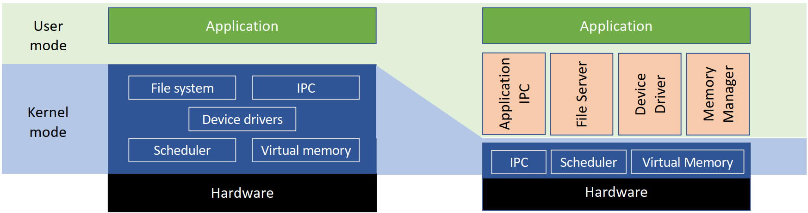
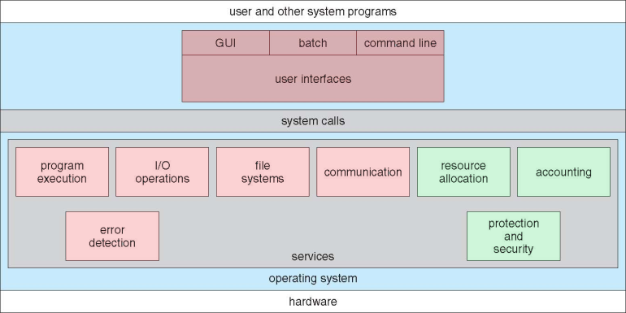

[TOC]

## 第二章 OS基础

### 2.1 双模式 dual-mode

#### 2.1.1 双模式的概念

- 用户态  User Mode：正常运行应用软件的模式
- 内核态 Kernel Mode：更底层的运行模式，运行OS核心内容，拥有预防恶意软件、软件报错的能力
- 机械态 Machine Mode：RISC-V 特有模式，最高权限级别。
- 双模式好处：保护OS和其他系统组件

#### 2.1.2 所需硬件支持

- 一个比特，用于表示所处模式
- 一些指令，仅允许在内核态执行，用户态报错
- 用户 $\rightarrow$ 内核：保存用户态状态，置内核态
- 内核 $\rightarrow$ 用户：清空内核态，回复用户态状态

#### 2.1.3 状态转换方式

##### 2.1.3.1 系统调用 System Call

- 用户程序向OS内核请求服务的一种机制，涉及上下文切换。
- 每个系统调用有唯一编号，系统调用接口（System-call Interface）是内核中维护的表格，由编号做索引，对应入口点做值。
- 调用过程：
  1. 用户将 syscall id 和参数放入寄存器，调用 syscall
  2. 从用户态切换到内核态，系统调用接口根据寄存器数值，调用相应内核函数。
  3. 将返回值传递给调用者，切换回用户态。
- syscall 具体实现封装于 library API 和 run-time support library，一般由高级语言（C/C++）编写。

#####  2.1.3.2 中断 Interrupt

- 外部异步事件，独立于用户进程，可在任何时刻发生，抢占式触发，如OS定时器。
- 中断发生时，处理器保存上下文，切换到内核空间处理中断。处理完毕后，恢复原先上下文，继续执行被中断的任务。

##### 2.1.3.3 异常 Exception

- 陷阱 Trap 或 异常 Exception：内部同步事件，由用户程序的错误或特殊情况触发，如 DivideByZero。	
- 当程序遇到不正常的情况时，处理器会自动触发异常并切换到内核空间执行异常处理程序。

##### 2.1.3.4 中断与异常相同点

- 均暂停执行当前程序，进入内核态执行处理程序（handler）
- 均通过中断描述符表（Interrupt Descriptor Table, IDT）访问处理程序
  - IDT是一个由操作系统维护的表格，其中每个条目都包含了一个异常或中断处理程序的地址。处理器根据异常或中断的编号（每个异常和中断都有一个唯一的编号）来查找IDT中对应的入口点。
  - 中断和异常均有唯一编号
- 处理完毕后均需恢复上下文，返回用户态

### 2.2 内核结构

左侧为宏内核，右侧为微内核

#### 2.2.1 宏内核 Monolithic Kernel 

- Monolithic Kernel，中译宏内核、单内核、单体内核
- 一种OS内核的设计模式，将所有功能和组件集成在一个庞大的内核中，拥有所有权限，该程序作为内核运行
- 采用宏内核架构的OS：Linux, Unix 等
- 优点：相比于微内核，更加紧凑和高效
- 缺点：更加难以维护和升级。

#### 2.2.2 微内核 Macro Kernel

- 将传统操作系统的功能下放给用户服务器，微内核信任用户服务器，允许以root身份运行
- 保护机制保留在内核中，而资源管理策略转移到用户级服务器
- 优点：
  - 内核功能可在抢占用户进程中执行，反应更快
  - 内核中代码少，更稳定更安全
  - 更好支持并发和分布式OS
- 缺点：需要更多进程间通信（Inter-Process Communication，IPC），更多上下文切换，因此更慢

#### 2.2.3 混合内核 Hybrid Kernel

- 结合了单体内核和微内核的特点，Windows OS用的就是混合内核

#### 2.2.4 外核 Exokernel

- 一种很新的OS概念，仅在论文中见过（zyq原话）

- 内核非常小：仅负责安全性和多路复用。
- 库操作系统（Library OS）作为进程运行
- 优点：
  - LibOS直接管理资源，更高效
  - 方便实验新内核结构
- 缺点：
  - 大部分仅停留在概念阶段。
- 变体：纳内核（nanokernel）、皮内核（picokernel）。

#### 2.2.5 虚拟机监视器 Hypervisor

- 虚拟机监视器（Hypervisor），也称虚拟机管理器/监控器（Virtual Machine Manager/Monitor, VMM）
- 强调虚拟化（virtualization）和隔离（isolation），可以运行OS
- 负责管理分配物理资源，并按需分配给运行在其上的虚拟机
- 微内核和外核可用于实现虚拟机
- Is QEMU a hypervisor?
  - QEMU（Quick Emulator）是一个开源的虚拟机模拟器和虚拟化器
  - QEMU本身不是 hypervisor，但可与KVM（Kernel-based Virtual Machine）一起，实现类似 hypervisor 的功能
  - QEMU提供了设备模拟和用户空间接口，KVM负责处理底层硬件虚拟化

#### 2.2.6 OS设计原则

- ​	将策略（Policy）与机制（Mechanism）分离
  - 策略：规定哪个软件可以在何时访问哪个资源
  - 机制：如何执行策略
- 优点：方便未来修改策略决策，提供最大灵活性

### 2.3 Operating System Services

#### 2.3.1 OS提供的服务

OS为用户提供以下服务，大致可分为两大类。

- Helpful to the user: 红色部分
- Ensure the efficient operation  of the system itself via resource sharing: 绿色部分

#### 2.3.2 系统程序 System Programs

- File management
- Status information：获取和展示系统的状态信息
- File modification
- Programming-language support
- Program loading and execution
- Communications：通信服务